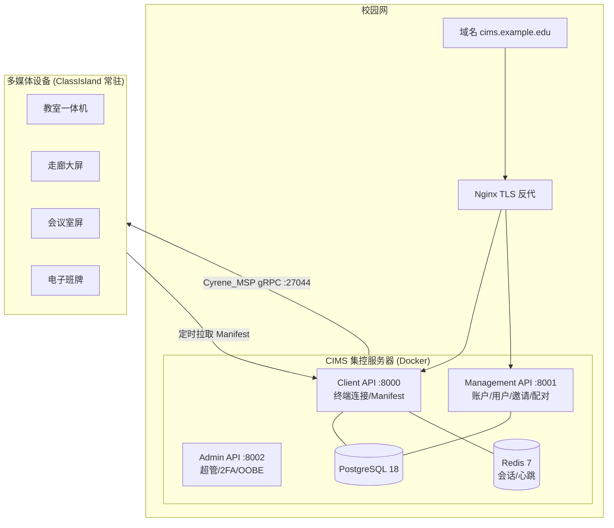
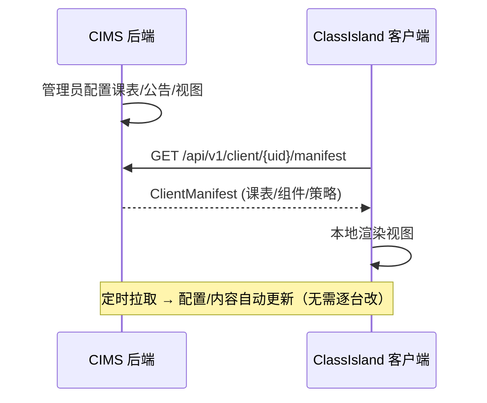
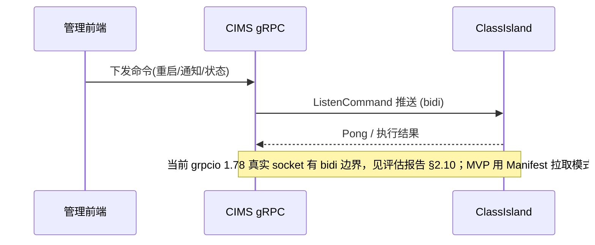
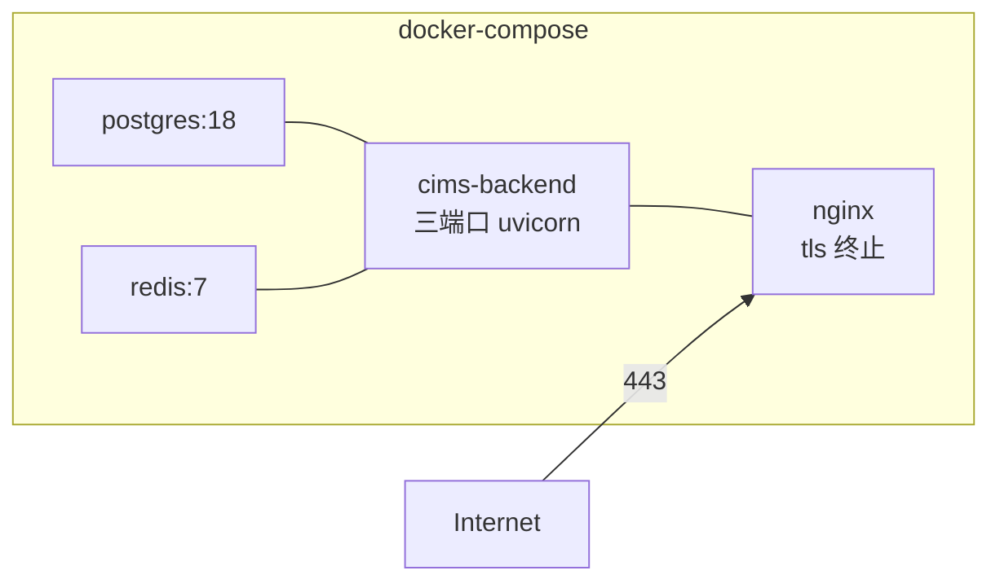

# 学校多媒体统一集控 · 架构图

> 配合 `docs/实施方案.md` 阅读。所有图用 mermaid，可在支持 mermaid 的编辑器/平台直接渲染。

## 1. 整体架构

## 2. 数据流（配置/内容自动更新）

## 3. 命令流（实时控制，走 gRPC）

## 4. 部署拓扑（Docker）

## 5. 自动隐藏 / 自动更新 映射

| 能力 | 实现层 | 触发 |
|---|---|---|
| 自动隐藏浮窗 | ClassIsland 自动化 | 上课/投影/考试时段 → 切换视图/隐藏 |
| 客户端自动更新 | 内网更新源 | 更新器定时检查 → 升级 |
| 配置自动更新 | CIMS Manifest | 客户端定时拉取 → 刷新 |
| 批量运维 | CIMS 命令 | 管理端批量下发 RestartApp/更新 |
