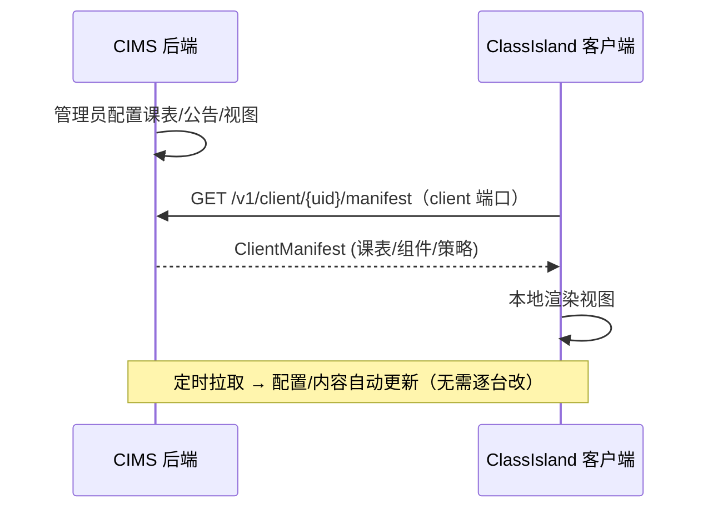
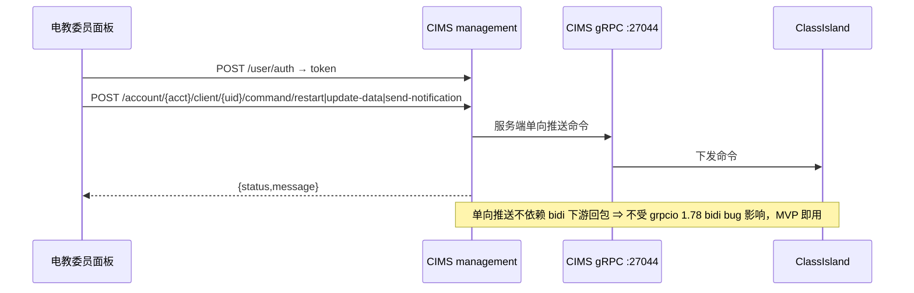
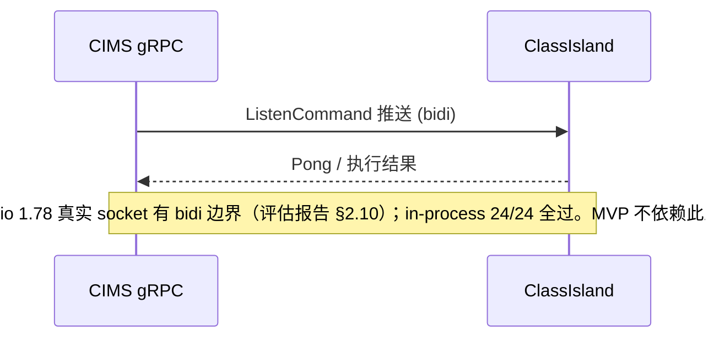
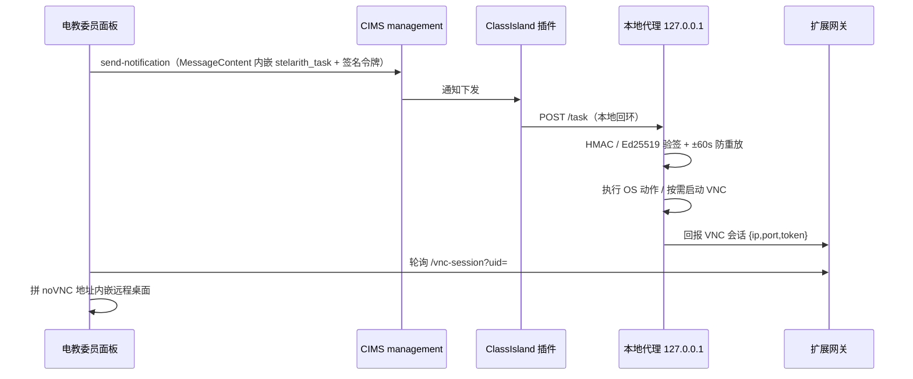
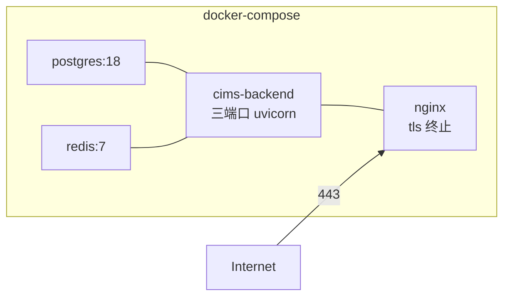

# 学校多媒体统一集控 · 架构图

> 配合 `docs/实施方案.md` 阅读。所有图用 mermaid，可在支持 mermaid 的编辑器/平台直接渲染。

## 1. 整体架构

```mermaid
graph TB
    subgraph Campus["校园网"]
        DNS[域名 cims.example.edu]
        subgraph CIMS["CIMS 集控服务器 (Docker)"]
            Client[Client API :8000\n终端连接/Manifest]
            Mgmt[Management API :8001\n账户/用户/邀请/配对]
            Admin[Admin API :8002\n超管/2FA/OOBE]
            PG[(PostgreSQL 18)]
            RD[(Redis 7\n会话/心跳)]
            Client --- PG
            Mgmt --- PG
            Client --- RD
        end
        DNS --> Nginx[Nginx TLS 反代]
        Nginx --> Client
        Nginx --> Mgmt
    end

    CIMS -->|Cyrene_MSP gRPC :27044| Clients

    subgraph Clients["多媒体设备 (ClassIsland 常驻)"]
        C1[教室一体机]
        C2[走廊大屏]
        C3[会议室屏]
        C4[电子班牌]
        P1[Stelarith 控制插件\n收 stelarith_task]
        A1[本地代理 127.0.0.1:17999\n验签执行 OS 动作 / 按需 VNC]
        P1 --- A1
    end

    Clients -->|定时拉取 Manifest| Client

    subgraph Ops["电教委员侧"]
        CONSOLE[admin-console 集控面板\nTauri2 + 零框架前端]
        EXT[stelarith-ext-gateway\n聊天/工单/Bug/审计/VNC 回执（自有）]
    end
    CONSOLE -->|POST /account/{acct}/client/{uid}/command/*| Mgmt
    CONSOLE -->|POST /account/{acct}/{type}/write| Mgmt
    CONSOLE -->|GET /v1/client/...| Client
    CONSOLE -->|协作/上报/VNC 回执| EXT
    A1 -->|VNC 会话回报 {ip,port,token}| EXT
```

## 2. 数据流（配置/内容自动更新）



## 3. 命令流（面板主路径：management HTTP，CIMS 原生）

> **已源码核实**：CIMS `management` 端口经 `app/api/management/account_router.py` 以
> `prefix="/account/{account_id}/client"` 原生挂载客户端控制接口，面板直接调用，
> **无需自建 HTTP→gRPC 命令代理**。



### 3.1 备用路径：bidi 实时流（当前不可用）



### 3.2 OS 级动作（锁屏 / 截图 / 远程屏）—— CIMS 无原生接口



## 4. 部署拓扑（Docker）



## 5. 自动隐藏 / 自动更新 映射

| 能力 | 实现层 | 触发 |
|---|---|---|
| 自动隐藏浮窗 | ClassIsland 自动化 | 上课/投影/考试时段 → 切换视图/隐藏 |
| 客户端自动更新 | 内网更新源 | 更新器定时检查 → 升级 |
| 配置自动更新 | CIMS Manifest | 客户端定时拉取 → 刷新 |
| 批量运维 | CIMS 命令 | 管理端批量下发 RestartApp/更新 |
